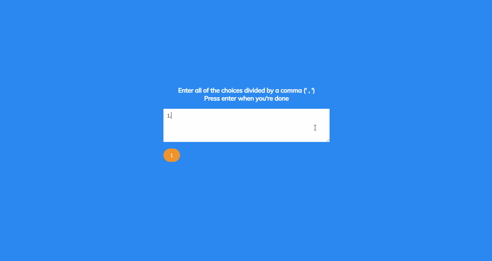

# Random Choice Picker



## 🦉 Main information

Little project for picking random choices built with HTML, CSS and Vanilla Js.

The project goal:
- as soon as the user starts to type for example 'choice1', it'll format as like a tag below the textarea
- to create another one, a user needs to put a comma and starts to type again (for example 'choice2' etc.)
- when a user hits Enter, it's going to give cool little animation effect and it's going to stop on a random choice
- it's also going to clean the textarea
- set up it in HTML, style it with CSS and add the functionality with JavaScript

## 🦊 Useful links 

### HTMLElement.focus()

```
https://developer.mozilla.org/en-US/docs/Web/API/HTMLElement/focus
```

### setTimeout() method

```
https://developer.mozilla.org/en-US/docs/Web/API/setTimeout
```

### setInterval() method

```
https://developer.mozilla.org/en-US/docs/Web/API/setInterval
```

### Math.floor() method

```
https://developer.mozilla.org/en-US/docs/Web/JavaScript/Reference/Global_Objects/Math/floor
```

### Math.random() method

```
https://developer.mozilla.org/en-US/docs/Web/JavaScript/Reference/Global_Objects/Math/random
```

## ⚡ Built With
[HTML5](https://www.w3schools.com/html/) / [CSS3](https://www.w3schools.com/css/) / [JavaScript](https://www.w3schools.com/js/)